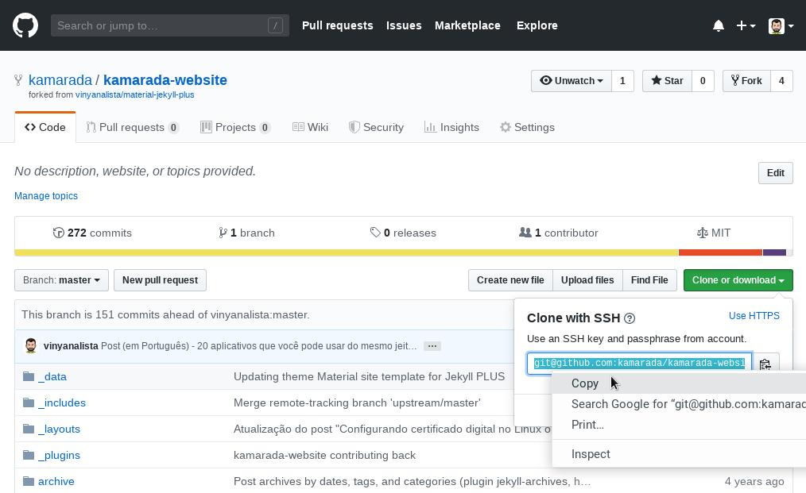

# SSH

<!-- TOC -->

- [1. Test connecting via SSH](#1-test-connecting-via-ssh)
  - [1.1. GitHub](#11-github)
  - [1.2. GitLab](#12-gitlab)
  - [1.3. Bitbucket](#13-bitbucket)
- [2. Clone a repository using SSH](#2-clone-a-repository-using-ssh)
- [3. Reconfigure existing repositories to use SSH](#3-reconfigure-existing-repositories-to-use-ssh)
- [Reference](#reference)

<!-- /TOC -->

## 1. Test connecting via SSH

**GitHub**, **GitLab** and **Bitbucket** allow you to test whether SSH connection has been set up correctly before actually using it with Git.

### 1.1. GitHub

After you’ve added your SSH key to your GitHub account, open the terminal and run:

```bash
ssh -T git@github.com
```

That command attempts an SSH remote access to GitHub.

If that is the first time you connect to GitHub via SSH, the SSH client asks you if it can trust the public key of the GitHub server:

```text
The authenticity of host 'github.com (140.82.113.4)' can't be established.
RSA key fingerprint is SHA256:nThbg6kXUpJWGl7E1IGOCspRomTxdCARLviKw6E5SY8.
Are you sure you want to continue connecting (yes/no)?
```

Type `yes` and press `Enter`. The SSH client adds GitHub to the list of trusted hosts:

```text
Warning: Permanently added 'github.com,140.82.113.4' (RSA) to the list of known hosts.
```

Once added to the list of known hosts, you won’t be asked about GitHub’s public key again.

As this remote access via SSH is provided by GitHub just for testing, not for actual use, the server informs that you have successfully authenticated and terminates the connection:

```text
Hi your_user_name! You've successfully authenticated, but GitHub does not provide shell access.
```

If you completed the test successfully, now you can use SSH with GitHub.

### 1.2. GitLab

If you have added your SSH key to your GitLab account, the test is very similar:

```bash
ssh -T git@gitlab.com
```

### 1.3. Bitbucket

If you have added your SSH key to your Bitbucket account, the test is very similar:

```bash
ssh -T git@bitbucket.org
```

## 2. Clone a repository using SSH

At GitHub, go to a project’s repository, click **Clone or download** and copy the URL to clone the repository using SSH:



```bash
git clone git@github.com:your_user_name/your_project_name.git
git clone git@gitlab.com:your_user_name/your_project_name.git
git clone git@bitbucket.org:your_user_name/your_project_name.git
```

例如：

```bash
git clone git@github.com:lsieun/lsieun-task.git
```

## 3. Reconfigure existing repositories to use SSH

The repositories we clone from now on using `SSH` will continue to use `SSH` for future Git commands such as `git pull` and `git push`. But existing local repositories, previously cloned with `HTTPS`, will continue to use `HTTPS`, unless we set them up to use `SSH`.

List the existing remote repositories and their URLs with:

```bash
git remote -v
```

That command should output something like:

```text
origin  https://your_server/your_user_name/your_project_name.git (fetch)
origin  https://your_server/your_user_name/your_project_name.git (push)
```

Change your remote repository’s URL with:

```bash
git remote set-url origin git@your_server:your_user_name/your_project_name.git
```

例如：

```bash
git remote set-url origin git@github.com:lsieun/lsieun-task.git
```

Run `git remote -v` once more to verify that the remote repository’s URL has changed:

```text
origin  git@your_server:your_user_name/your_project_name.git (fetch)
origin  git@your_server:your_user_name/your_project_name.git (push)
```

Great. That done, Git will use `SSH`, instead of `HTTPS`, to synchronize that local repository with its remote equivalent.

## Reference

- [Using Git with SSH keys](https://kamarada.github.io/en/2019/07/14/using-git-with-ssh-keys/#.XmDef3UzZhE)
